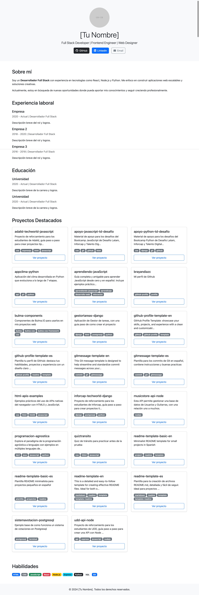

# 📌 Plantilla Portafolio Básico

Portafolio personal desarrollado con **HTML5**, **CSS3**, y **Bootstrap 5.3**. Incluye secciones como perfil, experiencia, educación, habilidades y proyectos destacados.

Diseñado para mostrar mi perfil profesional como **Desarrollador Full Stack** y facilitar el contacto a través de redes sociales y correo electrónico.

## 🖼️ Vista Previa

| Inicio                        |
| ----------------------------- |
|  |

## 🧰 Tecnologías Usadas

- [Bootstrap 5.3](https://getbootstrap.com/)
- [HTML5](https://developer.mozilla.org/es/docs/Web/HTML)
- [CSS3](https://developer.mozilla.org/es/docs/Web/CSS)
- [Font Awesome](https://fontawesome.com/)
- [GitHub API](https://docs.github.com/en/rest)

## 📁 Estructura del Proyecto

```bash
bootstrap-portfolio/
├── assets/
│ ├── css/
│ │ └── styles.css
│ └── js/
│ └── app.js
├── index.html
├── README.md
└── ...
```

## 🚀 Cómo usar

1. Clona el repositorio:

```bash
git clone https://github.com/brayandiazc/portafolio.git
cd portafolio
```

2. Abre `index.html` en tu navegador:

```bash
open index.html
# o doble clic en el archivo
```

## 📲 Funcionalidades

- Diseño responsivo (adaptable a móviles y escritorio)
- Secciones bien definidas: Sobre mí, Experiencia, Educación, Habilidades
- Enlaces directos a GitHub, LinkedIn y correo electrónico
- Íconos personalizados con Font Awesome
- Carga dinámica de proyectos desde tu cuenta de GitHub
- Datos estructurados JSON-LD para mejorar SEO

## 🔧 ¿Cómo funciona la integración con JavaScript?

La sección de proyectos destacados se genera **dinámicamente** usando JavaScript y la API pública de GitHub.

### Flujo:

1. En el HTML existe un contenedor vacío con el `id="project-cards"`.
2. El script `app.js` se ejecuta cuando carga la página.
3. Este código llama a la GitHub API usando `fetch()` y obtiene los repositorios del usuario.
4. Solo muestra repositorios que tengan al menos un `topic`.
5. Por cada repo válido, crea una **card de Bootstrap** con el nombre, descripción, badges y un botón.

### Fragmento de código clave:

```js
const githubUsername = "brayandiazc";
const projectContainer = document.getElementById("project-cards");

async function fetchUserRepos() {
  const res = await fetch(
    `https://api.github.com/users/${githubUsername}/repos`
  );
  const repos = await res.json();
  repos.forEach((repo) => {
    if (repo.topics?.length) renderProjectCard(repo);
  });
}
```

Esto automatiza la sección de proyectos sin tener que editar el HTML cada vez que agregas algo nuevo a tu GitHub. ¡Una solución limpia y moderna!

## 🛣️ Roadmap

- [ ] Agregar sección de blog
- [ ] Animaciones con AOS.js
- [ ] Formulario de contacto funcional (via Formspree o similar)
- [ ] Tema oscuro

## 🖇️ Contribuye

¿Quieres colaborar? Haz un fork, crea tu rama (`feature/nueva-funcionalidad`), haz tus cambios y abre un pull request.

## 📄 Licencia

MIT — ver [LICENSE](LICENSE.md)

---

⌨️ con ❤️ por [Brayan Diaz C](https://github.com/brayandiazc)
